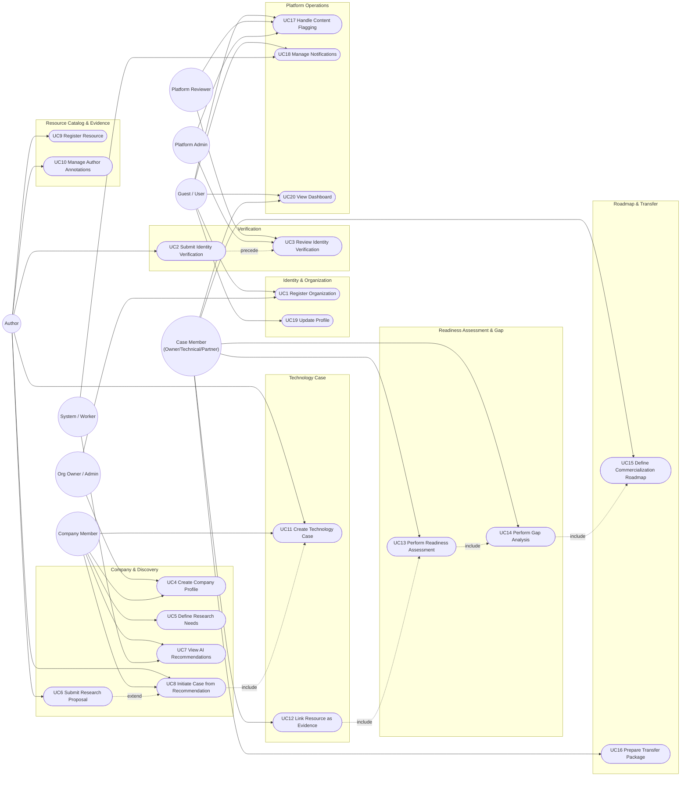
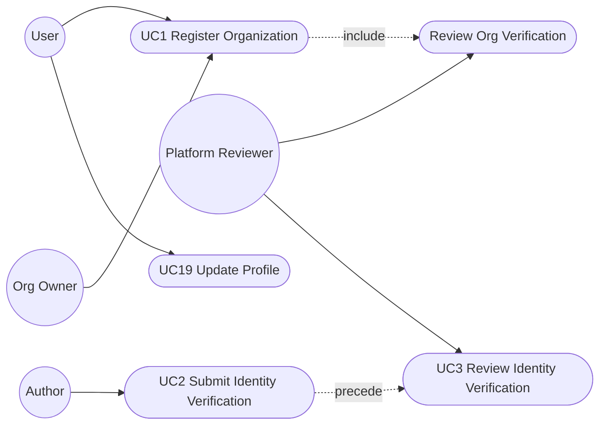
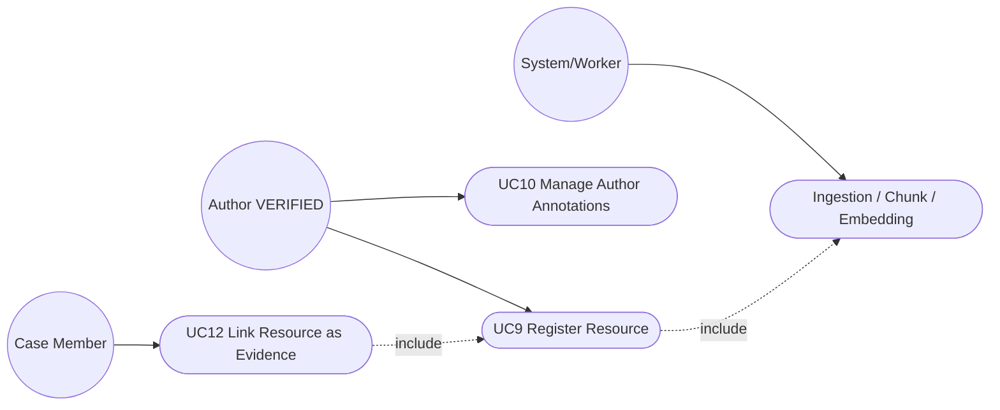
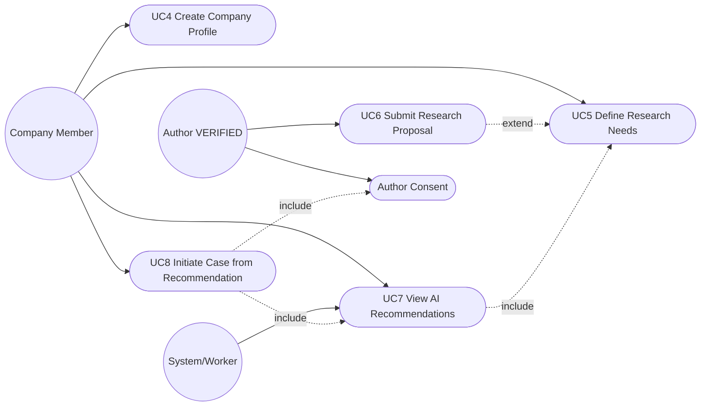
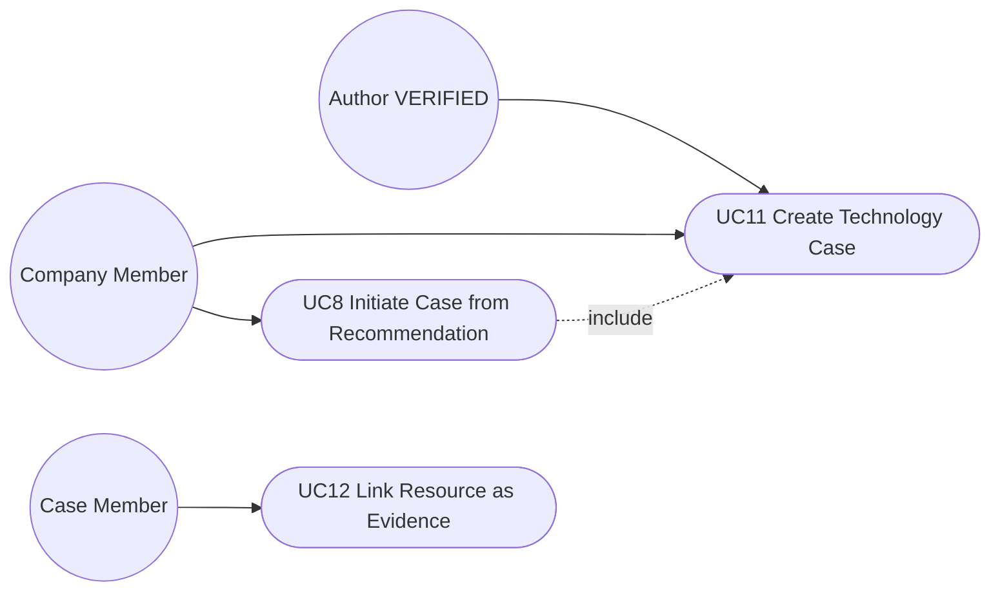
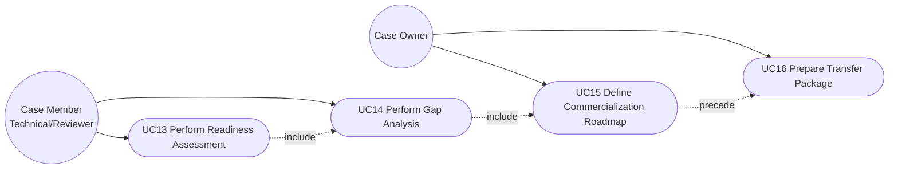
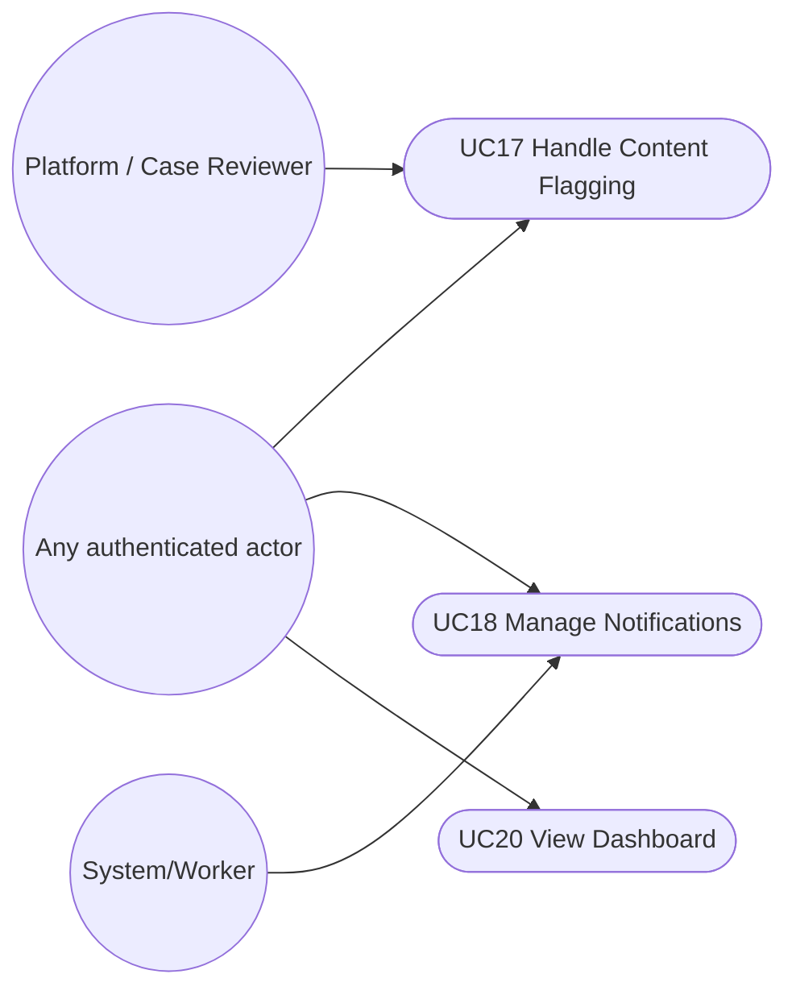

# R2M V5 — Sơ đồ Use Case

> Mermaid không có ký hiệu UML use-case chuẩn (actor que + hình ellipse), nên các sơ đồ dưới dùng
> flowchart: **actor** = hình chữ nhật bo góc `(Tên actor)`, **use case** = hình oval `([Tên use case])`,
> đường nối = mối quan hệ actor–use case. Mỗi bounded context là một subgraph, tương ứng 1 gói use case.
> Nguồn use case: `USE_CASE_COVERAGE_MATRIX.md` (20 use case).

## 0. Danh sách Actor (theo mô hình quyền 3 tầng, mục 4 kiến trúc plan)

| Actor | Loại quyền | Ghi chú |
|---|---|---|
| Guest/User | Platform role `USER` | Người dùng đã đăng nhập, chưa có role đặc biệt |
| Author (Unverified/Pending/Verified) | Profile, không phải platform role | Xác định qua `author_profile` |
| Org Owner / Org Admin | Organization role | `organization_member` |
| Company Member | Organization role trong org type ENTERPRISE | Dùng chung cơ chế `organization_member` |
| Case Owner / Technical Member / Case Reviewer / Partner Member / Viewer | Case role | `case_member` |
| Platform Reviewer | Platform role `PLATFORM_REVIEWER` | Duyệt xác minh, kiểm duyệt cấp nền tảng |
| Platform Admin | Platform role `PLATFORM_ADMIN` | Toàn quyền hệ thống |
| System / Worker | Actor kỹ thuật | Recommendation worker, notification worker, ingestion job |

---

## 1. Sơ đồ tổng thể (toàn bộ 20 use case theo 8 bounded context)

---

## 2. Sơ đồ chi tiết theo từng bounded context

### 2.1 Identity & Organization + Verification

### 2.2 Resource Catalog & Evidence

### 2.3 Company & Discovery

### 2.4 Technology Case

### 2.5 Readiness Assessment & Gap + Roadmap & Transfer

### 2.6 Platform Operations

---

## 3. Ghi chú quan hệ include/extend

- `UC8 include UC11`: chấp nhận case initiation request luôn tạo Technology Case trong cùng transaction.
- `UC6 extend UC5`: nộp proposal mở rộng từ một Research Need đã publish.
- `UC12 include UC9`: link evidence yêu cầu resource/resource_version đã tồn tại và có access grant.
- `UC13 include UC14`, `UC14 include UC15`: assessment → gap → roadmap là chuỗi tuần tự bắt buộc theo lifecycle Technology Case (mục 5.6).
- `UC2 precede UC3`: submit verification luôn xảy ra trước review verification.
- `UC15 precede UC16`: roadmap phải APPROVED trước khi case đủ điều kiện chuẩn bị transfer.
