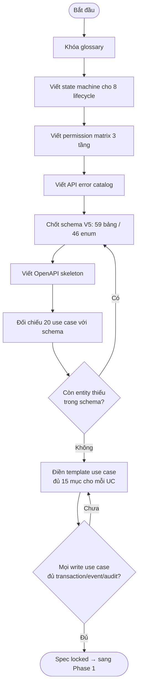
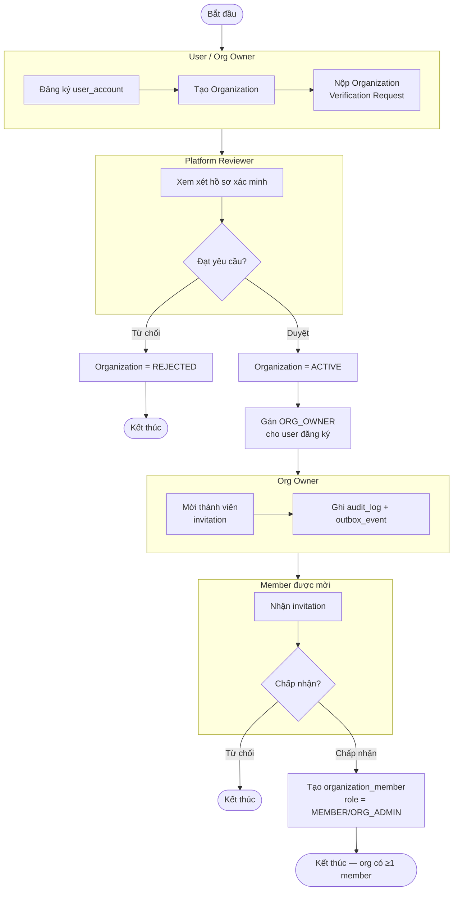
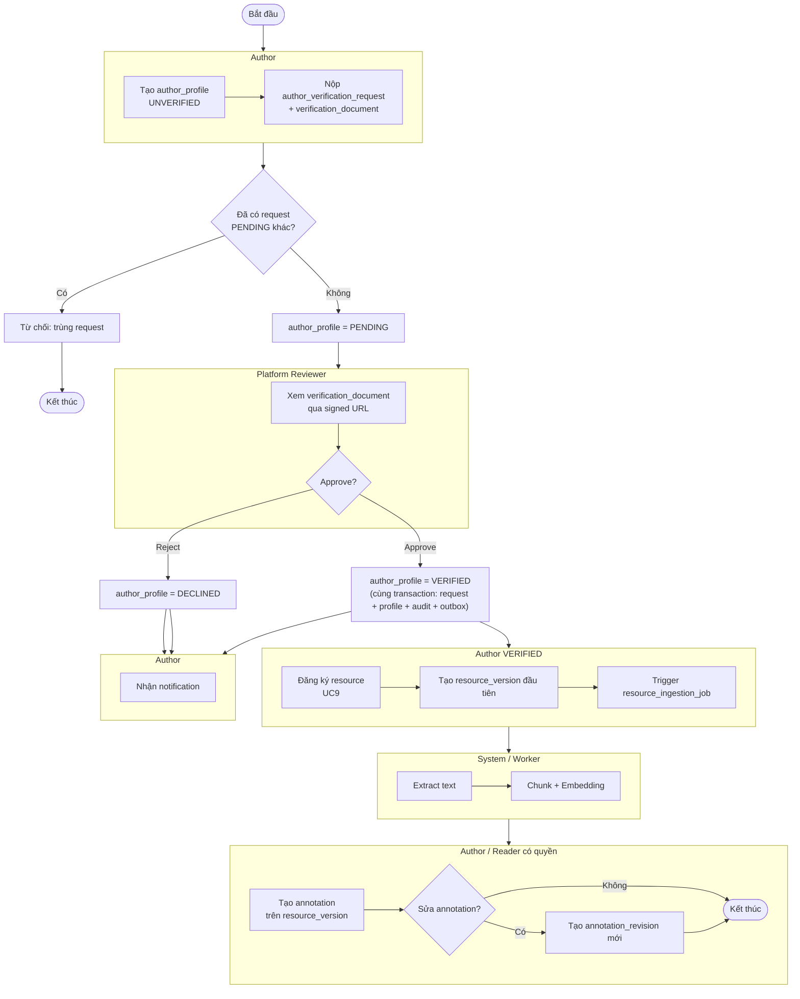
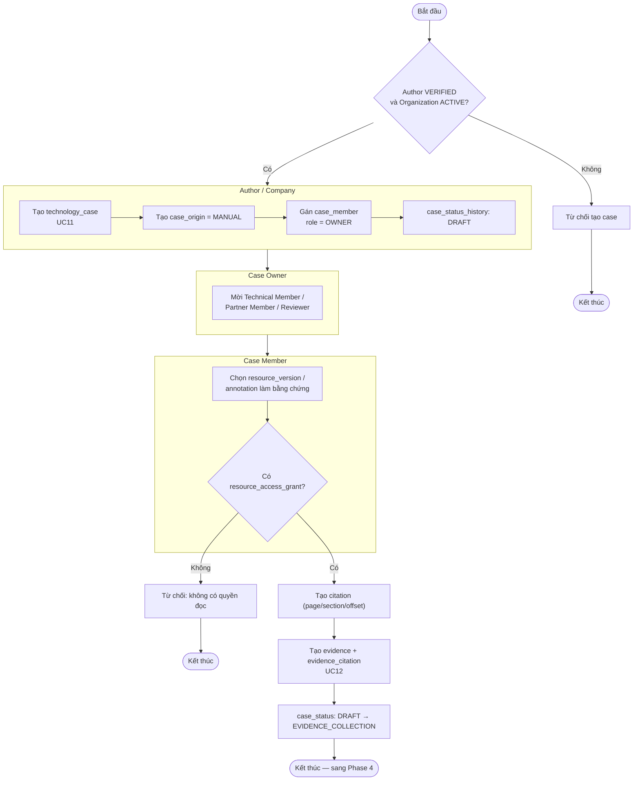
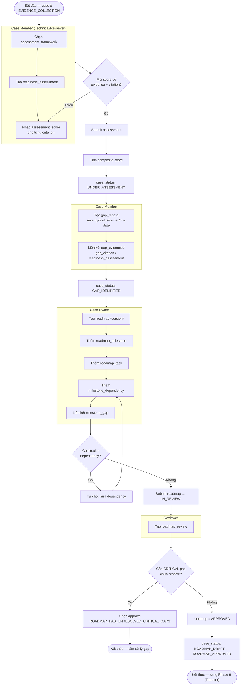
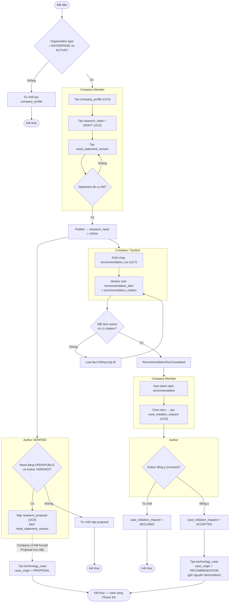
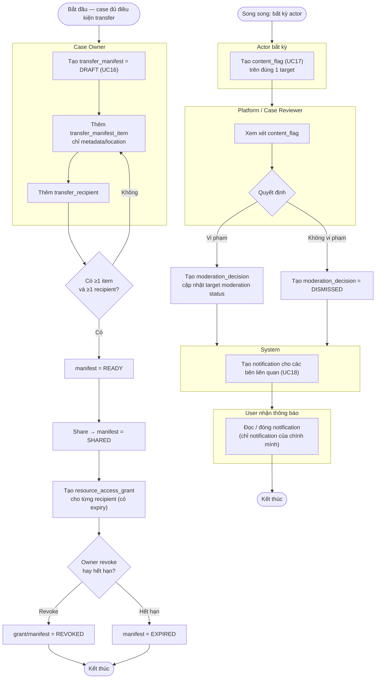
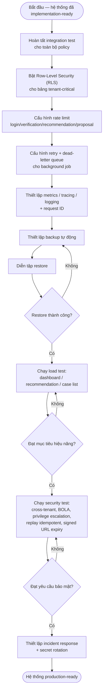

# R2M V5 — Activity Diagram theo từng Phase

> Ký hiệu: hình oval `([...])` = điểm bắt đầu/kết thúc, hình chữ nhật `[...]` = hoạt động,
> hình thoi `{...}` = quyết định (decision), subgraph = nhóm hoạt động theo actor (giả lập swimlane).
> Mỗi diagram tương ứng với workflow chính của phase đó trong `01_workflow_theo_phase.md`.

---

## Phase 0 — Spec Lock

---

## Phase 1 — Platform Foundation

---

## Phase 2 — Author & Resource

---

## Phase 3 — Technology Case & Evidence

---

## Phase 4 — Assessment, Gap, Roadmap

---

## Phase 5 — Company & Discovery

---

## Phase 6 — Transfer & Moderation

---

## Phase 7 — Production Hardening

