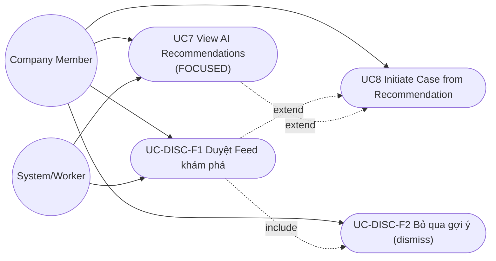
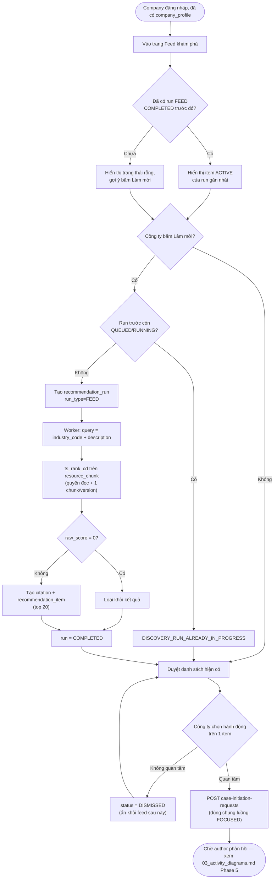

# R2M V5 — Thiết kế & Workflow đầy đủ: Phase 5 (Company & Discovery)

> Tài liệu tổng hợp, dùng làm nguồn tham chiếu chính khi triển khai Phase 5 — hợp nhất và mở
> rộng nội dung từ `01_workflow_theo_phase.md` (mục Phase 5), `04_phase5_recommendation_detail.md`
> (chi tiết thuật toán recommendation), `05_phase5_feed_extension.md` (bổ sung Feed) và
> `07_phase5_public_profiles.md` (tóm tắt trên feed card + trang công khai tác giả/tổ chức). 4 file
> đó **vẫn giữ nguyên**, dùng khi cần đào sâu 1 phần cụ thể — file này là bản đầy đủ để đọc 1 lần
> trước khi bắt đầu code Phase 5, không phải đọc rời rạc 5 file.

---

## 0. Vị trí trong lộ trình

- **Phụ thuộc:** Phase 2 (Author VERIFIED, Resource + `resource_chunk` đã có nội dung — **điều
  kiện tiên quyết thật**, xem cảnh báo ở mục 11), Phase 3 (logic tạo Technology Case dùng chung).
- **Mở khóa:** không chặn phase nào theo chiều thuận — case tạo từ Phase 5 tiếp tục vòng đời qua
  Phase 4 (assessment/gap/roadmap) và Phase 6 (transfer) y hệt case tạo thủ công.
- **Có thể chạy song song Phase 4** nếu đủ nguồn lực, miễn Phase 3 đã xong.

## 1. Mục tiêu & phạm vi

Kết nối phía doanh nghiệp với tác giả/công nghệ qua 2 con đường bổ sung nhau:

1. **Tra cứu có định hướng** (đã có từ đầu): công ty đăng nhu cầu nghiên cứu cụ thể
   (`research_need`) → nhận đề xuất từ tác giả (`research_proposal`) hoặc gợi ý AI theo đúng nhu
   cầu đó (`recommendation_run` loại `FOCUSED`).
2. **Duyệt khám phá** (bổ sung, quyết định ở lượt trước): công ty vào app thấy ngay 1 feed cá
   nhân hóa dựa trên hồ sơ tổ chức (`recommendation_run` loại `FEED`), không cần biết trước mình
   cần gì cụ thể.

Cả 2 con đường đều dẫn tới cùng 1 đích: **khởi tạo Technology Case có sự đồng ý của tác giả**
(`case_initiation_request`), tái sử dụng đúng 1 luồng tạo case của Phase 3.

## 2. Mô hình dữ liệu đầy đủ

### 2.1 Bảng đã có từ đầu (không đổi)

| Bảng | Vai trò |
|---|---|
| `company_profile` | Hồ sơ công ty — `industry_code`, `company_size`, `description`; PK = `organization_id`, chỉ tạo được khi org `type=ENTERPRISE` và `ACTIVE` |
| `research_need` | Nhu cầu nghiên cứu — status `DRAFT → OPEN → PAUSED → OPEN`, `OPEN → CLOSED → ARCHIVED`; có `visibility` (PUBLIC/ORGANIZATION_ONLY/PARTNERS_ONLY/PRIVATE) |
| `need_statement_version` | Nội dung nhu cầu theo version — `problem_statement`, `technical_field`, `desired_output_type`, `timeframe_months`, `constraints`, `success_criteria`; không update in-place |
| `research_proposal` | Đề xuất từ tác giả — bám đúng 1 `need_statement_version_id` tại thời điểm nộp; status `DRAFT → SUBMITTED → UNDER_REVIEW → ACCEPTED/REJECTED`, hoặc `→ WITHDRAWN` |
| `recommendation_item` | 1 gợi ý resource — `rank`, `match_score` (decimal 6,5), `rationale` (bắt buộc), status `ACTIVE/DISMISSED/SELECTED` |
| `recommendation_citation` | Nối `recommendation_item` ↔ `citation` — bắt buộc ≥1 cho item ACTIVE |
| `case_initiation_request` | Yêu cầu khởi tạo case từ 1 `recommendation_item` — cần author consent, `expires_at` mặc định 14 ngày, status `PENDING → ACCEPTED/DECLINED/CANCELLED/EXPIRED` |

### 2.2 Thay đổi schema cho Feed (additive, đã chốt ở `05`)

```diff
 Table recommendation_run {
   id uuid [pk, default: `gen_random_uuid()`]
-  research_need_id uuid [not null, ref: > research_need.id]
-  need_statement_version_id uuid [not null, ref: > need_statement_version.id]
+  research_need_id uuid [ref: > research_need.id]
+  need_statement_version_id uuid [ref: > need_statement_version.id]
+  company_organization_id uuid [ref: > organization.id]
+  run_type RecommendationRunType [not null, default: 'FOCUSED']
   requested_by_user_id uuid [not null, ref: > user_account.id]
   status RecommendationRunStatus [not null, default: 'QUEUED']
   model_provider varchar(100)
   model_name varchar(150)
   prompt_version varchar(100)
   model_parameters jsonb
   started_at timestamptz
   completed_at timestamptz
   error_code varchar(100)
   error_message text
   created_at timestamptz [not null, default: `now()`]
 }

+Enum RecommendationRunType {
+  FOCUSED   -- gắn 1 research_need cụ thể
+  FEED      -- sinh từ company_profile, không gắn need cụ thể
+}
```

```sql
ALTER TABLE recommendation_run
  ADD CONSTRAINT chk_recommendation_run_context_matches_type
  CHECK (
    (run_type = 'FOCUSED' AND research_need_id IS NOT NULL AND need_statement_version_id IS NOT NULL AND company_organization_id IS NULL)
    OR
    (run_type = 'FEED' AND research_need_id IS NULL AND need_statement_version_id IS NULL AND company_organization_id IS NOT NULL)
  );
```

Pattern constraint này **tái dùng đúng cách đã làm** ở `verification_document` ("Exactly one
verification request FK must be non-null") — không phát minh cách mới.

Không đổi `recommendation_item`, `recommendation_citation`, `case_initiation_request` — cả 3 chỉ
quan tâm `recommendation_run_id`/`recommendation_item_id`, không phân biệt loại run.

### 2.3 Thay đổi schema cho Trang công khai (additive, đã chốt ở `07`)

```diff
 Table author_profile {
   user_id uuid [pk, ref: - user_account.id]
   current_affiliation_org_id uuid [ref: > organization.id]
+  public_slug varchar(160) [unique]
   orcid varchar(50) [unique]
   ...
 }
```

Sinh `public_slug` tự động lúc author chuyển `VERIFIED` (từ tên + hậu tố chống trùng), không bắt
tác giả tự đặt ở bản đầu.

**Không cần thêm gì cho tổ chức** — `company_profile.public_slug` **đã tồn tại sẵn trong schema
từ Phase 0** (ENTERPRISE org), chỉ chưa từng được dùng; tổ chức không phải ENTERPRISE (viện/
trường nghiên cứu) dùng `organization.slug` sẵn có. Đây là chỗ hiếm hoi trong Phase 5 không cần
migration gì cả, chỉ cần viết endpoint đọc.

### 2.4 Enum liên quan (đã khóa, không đổi)

```
ResearchNeedStatus:        DRAFT, OPEN, PAUSED, CLOSED, ARCHIVED
ProposalStatus:            DRAFT, SUBMITTED, UNDER_REVIEW, ACCEPTED, REJECTED, WITHDRAWN
RecommendationRunStatus:   QUEUED, RUNNING, COMPLETED, FAILED, CANCELLED
RecommendationItemStatus:  ACTIVE, DISMISSED, SELECTED
CaseInitiationStatus:      PENDING, ACCEPTED, DECLINED, CANCELLED, EXPIRED
VisibilityLevel:           PUBLIC, ORGANIZATION_ONLY, PARTNERS_ONLY, PRIVATE
```

---

## 3. Breakdown theo sprint

### Sprint 5.1 — Company Profile
1. `POST /organizations/:id/company-profile` — guard: org `type=ENTERPRISE` và `status=ACTIVE`.
2. `PATCH /organizations/:id/company-profile` — sửa `industry_code`/`company_size`/`description`
   (đây chính là dữ liệu Feed sẽ dùng làm query — chất lượng feed phụ thuộc trực tiếp vào việc
   công ty điền profile đầy đủ, nên cân nhắc UX nhắc điền profile ngay sau khi org được duyệt).

### Sprint 5.2 — Research Need
3. `POST /research-needs` → tạo `research_need(DRAFT)` + `need_statement_version` v1 trong cùng
   transaction.
4. `POST /research-needs/:id/versions` → thêm statement version mới (sửa nội dung need).
5. `POST /research-needs/:id/publish` → validate statement "đủ cụ thể" (application-layer,
   không chỉ NOT NULL — tối thiểu `problem_statement` đủ độ dài, `technical_field` không rỗng)
   → `status: DRAFT → OPEN`.
6. `POST /research-needs/:id/pause`, `/close` — quản lý vòng đời need.

### Sprint 5.3 — Research Proposal
7. `POST /research-needs/:id/proposals` — validate: need đang `OPEN` (hoặc `visibility` cho phép
   author thấy), Author `VERIFIED` → tạo `research_proposal(DRAFT/SUBMITTED)`, bám đúng
   `need_statement_version_id` hiện hành tại thời điểm nộp.
8. Luồng review nội bộ: `SUBMITTED → UNDER_REVIEW → ACCEPTED/REJECTED`; `SUBMITTED/UNDER_REVIEW
   → WITHDRAWN` (author tự rút).
9. `POST /proposals/:id/accept` → tạo Technology Case (`case_origin=PROPOSAL`) tái sử dụng đúng
   transaction Phase 3 (owner + organization + member + status_history) trong **cùng transaction**
   với update proposal.

### Sprint 5.4 — AI Recommendation (FOCUSED) — Phase 5a full-text
*(chi tiết đầy đủ thuật toán xem `04_phase5_recommendation_detail.md` — tóm tắt lại đây phần cần
biết để code, không lặp lại toàn bộ suy luận)*

10. `POST /research-needs/:id/recommendation-runs` → tạo `recommendation_run(run_type=FOCUSED)`
    → enqueue job. Guard: không tạo run mới nếu run trước của cùng need đang `QUEUED`/`RUNNING`
    (`DISCOVERY_RUN_ALREADY_IN_PROGRESS`).
11. Worker: query text = `problem_statement + technical_field + desired_output_type` →
    `ts_rank_cd` trên `resource_chunk.content` (GIN index đã có từ Phase 2) → giữ 1 chunk tốt
    nhất/`resource_version` → loại `raw_score = 0` → chuẩn hóa `match_score` 0..1 trong phạm vi
    1 run → giới hạn **top 10** → mỗi item tạo `citation` + `recommendation_citation` bắt buộc,
    rationale sinh theo template (`ts_headline`), **không LLM** ở Phase 5a.
12. Chỉ xét `resource_version` công ty có quyền đọc (`PUBLIC` hoặc có `resource_access_grant`
    ACTIVE).
13. `model_provider='postgres-fts', model_name='ts_rank_cd', prompt_version=null` — giữ nguyên
    cột này để Phase 5b chỉ cần đổi giá trị, không migration lại.
14. `GET /recommendation-runs/:id/items` → trả item ACTIVE kèm citation.

### Sprint 5.5 — Feed (FEED) — bổ sung, dùng lại toàn bộ hạ tầng Sprint 5.4
*(chi tiết đầy đủ xem `05_phase5_feed_extension.md`)*

15. Migration schema mục 2.2 — nullable 2 cột cũ, thêm `company_organization_id` + `run_type` +
    CHECK constraint. **Trình bày kế hoạch migration cho người phụ trách duyệt trước khi chạy**
    (đây là thay đổi schema thật đầu tiên kể từ Phase 0 spec lock).
16. `POST /company-profile/feed/refresh` → tạo `recommendation_run(run_type=FEED,
    company_organization_id=...)` → enqueue job.
17. Worker Feed: query text = `industry_code (map tên ngành đầy đủ) + description` từ
    `company_profile` → **dùng lại nguyên logic scoring của Sprint 5.4** (cùng 1 hàm, chỉ khác
    query text đầu vào) → giới hạn **top 20** (khác top 10 của FOCUSED), hỗ trợ tải thêm.
18. `GET /company-profile/feed` → trả item ACTIVE từ run FEED **mới nhất COMPLETED** của tổ chức.
19. `POST /recommendation-items/:id/dismiss` → `status → DISMISSED` — dùng chung cho cả FOCUSED
    lẫn FEED. Item từng dismiss trong 1 run FEED **không hiện lại** ở run FEED sau của cùng công
    ty (kiểm tra qua lịch sử `recommendation_item` join `recommendation_run` cùng
    `company_organization_id`, không chỉ trong phạm vi 1 run).

### Sprint 5.6 — Case Initiation (dùng chung cho cả FOCUSED và FEED)
20. `POST /recommendation-items/:id/case-initiation-requests` → tạo `case_initiation_request
    (PENDING)`, `expires_at = created_at + 14 ngày` → notify author. **Không cần biết item đến
    từ run loại nào** — endpoint này không đổi gì so với thiết kế ban đầu.
21. `POST /case-initiation-requests/:id/accept` → tạo `technology_case(case_origin=RECOMMENDATION)`,
    giữ nguyên recommendation_item/citation làm evidence ban đầu, trong cùng transaction với
    update request.
22. `POST /case-initiation-requests/:id/decline`.
23. Job định kỳ: quét `case_initiation_request(PENDING)` quá `expires_at` → `EXPIRED`, notify
    công ty.

### Sprint 5.7 — Tóm tắt trên card + Trang công khai Tác giả/Tổ chức
*(chi tiết đầy đủ xem `07_phase5_public_profiles.md`)*

24. Bổ sung field response cho `GET /recommendation-runs/:id/items` và `GET
    /company-profile/feed`: join thêm `paper_metadata` khi `resource.type=PAPER` để trả
    `abstract`/`publicationDate`; loại khác dùng `resource.description` làm tóm tắt. Không hiện
    khối tóm tắt nếu cả 2 đều null (không tạo placeholder giả).
25. Migration thêm `author_profile.public_slug` (mục 2.3) — sinh tự động khi author `VERIFIED`.
26. `GET /authors/:slug/public-profile` (không cần đăng nhập) → tên, đơn vị công tác, badge xác
    minh, `expertise_tags`, ORCID, danh sách `resource` có `created_by_user_id` = tác giả này
    **và `access_level = PUBLIC`**.
27. `GET /organizations/:slug/public-profile` (không cần đăng nhập, dùng `company_profile.
    public_slug` hoặc `organization.slug` tùy loại org) → tên, mô tả, danh sách tác giả
    `VERIFIED` có `current_affiliation_org_id` = tổ chức này, danh sách `resource` có
    `owner_organization_id` = tổ chức này **và `access_level = PUBLIC`**.
28. Điều hướng: tên tác giả/tổ chức trên mọi feed card (FOCUSED lẫn FEED) là link dẫn tới 2 trang
    trên — dùng chung 1 component hiển thị tên, không viết trùng ở nhiều nơi.

---

## 4. Danh sách API endpoint đầy đủ

| Method | Path | Actor | Transaction boundary | Event |
|---|---|---|---|---|
| POST | `/organizations/:id/company-profile` | Org member (ENTERPRISE, ACTIVE) | tạo company_profile | — |
| PATCH | `/organizations/:id/company-profile` | Org member | update profile | — |
| POST | `/research-needs` | Company Member | tạo need(DRAFT) + statement_version v1 | — |
| POST | `/research-needs/:id/versions` | Company Member | tạo statement_version mới | — |
| POST | `/research-needs/:id/publish` | Company Member | validate + status→OPEN | `ResearchNeedPublished` |
| POST | `/research-needs/:id/pause` \| `/close` | Company Member | update status | — |
| POST | `/research-needs/:id/proposals` | Author VERIFIED | validate need OPEN + tạo proposal | `ProposalSubmitted` |
| POST | `/proposals/:id/withdraw` | Author (chủ đề xuất) | status→WITHDRAWN | — |
| POST | `/proposals/:id/accept` | Company Member | update proposal=ACCEPTED + tạo case(origin=PROPOSAL) + owner/member + history + notification | `ProposalAccepted`, `TechnologyCaseCreated` |
| POST | `/proposals/:id/reject` | Company Member | update proposal=REJECTED + notification | — |
| POST | `/research-needs/:id/recommendation-runs` | Company Member | tạo run(FOCUSED, QUEUED), enqueue | `RecommendationRunRequested` |
| — (worker) | — | System | tạo recommendation_item + citation | `RecommendationRunCompleted` |
| GET | `/recommendation-runs/:id/items` | Company Member | read-only | — |
| POST | `/company-profile/feed/refresh` | Company Member | tạo run(FEED, QUEUED), enqueue | `RecommendationRunRequested` |
| GET | `/company-profile/feed` | Company Member | read-only, lấy run FEED mới nhất COMPLETED | — |
| POST | `/recommendation-items/:id/dismiss` | Company Member | status→DISMISSED | — |
| POST | `/recommendation-items/:id/case-initiation-requests` | Company Member | tạo request(PENDING) + notification tới author | `CaseInitiationRequested` |
| POST | `/case-initiation-requests/:id/accept` | Author (được yêu cầu) | update request=ACCEPTED + tạo case(origin=RECOMMENDATION) + giữ citation gốc + notification | `TechnologyCaseCreated` |
| POST | `/case-initiation-requests/:id/decline` | Author | update request=DECLINED + notification | — |
| GET | `/authors/:slug/public-profile` | Không cần đăng nhập | read-only, chỉ resource PUBLIC | — |
| GET | `/organizations/:slug/public-profile` | Không cần đăng nhập | read-only, chỉ resource PUBLIC + author VERIFIED | — |

---

## 5. Business rule / invariant đầy đủ

- `company_profile` chỉ tạo được khi org `type=ENTERPRISE` và `ACTIVE`.
- Need chỉ nhận proposal khi `OPEN`; Author phải `VERIFIED`.
- Proposal luôn bám `need_statement_version_id` tại thời điểm nộp — sửa need sau đó không làm
  proposal cũ lệch ngữ cảnh.
- Mỗi `recommendation_item` ACTIVE bắt buộc ≥1 `recommendation_citation` — **áp dụng như nhau
  cho cả FOCUSED và FEED**, không có ngoại lệ.
- Chỉ xét `resource_version` công ty có quyền đọc — **áp dụng như nhau cho cả 2 loại run**.
- 1 chunk tốt nhất đại diện mỗi `resource_version` trong 1 run (tránh 1 resource chiếm nhiều rank).
- `raw_score = 0` → không tạo item, không tạo "cho đủ số lượng".
- FOCUSED giới hạn top 10, FEED giới hạn top 20.
- `run_type=FOCUSED` bắt buộc có `research_need_id` + `need_statement_version_id`, không có
  `company_organization_id`; `run_type=FEED` ngược lại — enforce bằng CHECK constraint, không
  chỉ ở application layer.
- Item bị `DISMISSED` trong feed không hiện lại ở run FEED sau của cùng công ty.
- `case_initiation_request` bắt buộc author consent trước khi tạo case; giữ nguyên
  recommendation item/citation làm evidence ban đầu — không tạo evidence trùng lặp.
- Case tạo từ Proposal, từ Recommendation FOCUSED, hay từ Feed đều đi qua **cùng 1 service
  function** tạo case của Phase 3 (chỉ khác `case_origin` và nguồn evidence ban đầu).
- `case_initiation_request.expires_at` mặc định 14 ngày; job định kỳ chuyển `EXPIRED` khi quá hạn.
- Không giới hạn tần suất chạy run (FOCUSED lẫn FEED) ở bản đầu — chỉ chặn spam song song bằng
  `DISCOVERY_RUN_ALREADY_IN_PROGRESS`.
- **Không xây tính năng nhắn tin tự do công ty ↔ tác giả** — mọi liên hệ đi qua
  `case_initiation_request` (có consent, có audit, có expires).
- **Trang công khai tác giả/tổ chức chỉ hiện resource `access_level = PUBLIC`** — không có ngoại
  lệ, kể cả khi actor gọi API đang đăng nhập và có quyền xem resource đó qua
  `resource_access_grant`; đây là endpoint public, không phải endpoint theo quyền cá nhân.
- Trang công khai tổ chức chỉ liệt kê tác giả đã `VERIFIED` — không lộ danh sách người chưa xác
  minh.
- Trang công khai không hiện thông tin case/evidence/assessment nào — phạm vi chỉ giới hạn ở
  resource công khai và thông tin hồ sơ cơ bản.
- "Tài nguyên trên trang tác giả" chỉ tính resource có `created_by_user_id` = chính tác giả đó —
  không suy diễn thêm quan hệ đồng tác giả nào khác (schema không có bảng đồng-tác-giả).

---

## 6. Error code đầy đủ

| Mã lỗi | Khi nào trả về |
|---|---|
| `DISCOVERY_ORG_NOT_ENTERPRISE` | Tạo company_profile khi org không phải ENTERPRISE |
| `DISCOVERY_NEED_NOT_OPEN` | Nộp proposal hoặc chạy recommendation-run khi need không `OPEN` |
| `DISCOVERY_AUTHOR_NOT_VERIFIED` | Nộp proposal khi author chưa `VERIFIED` |
| `DISCOVERY_RUN_ALREADY_IN_PROGRESS` | Tạo run mới (FOCUSED hoặc FEED) khi run trước cùng ngữ cảnh còn `QUEUED`/`RUNNING` |
| `DISCOVERY_RECOMMENDATION_ITEM_MISSING_CITATION` | (nội bộ, không lộ API) worker phát hiện item sắp tạo không đủ citation — loại item, không insert |
| `DISCOVERY_INITIATION_REQUEST_NOT_PENDING` | Accept/decline request khi không còn `PENDING` |
| `DISCOVERY_INITIATION_REQUEST_EXPIRED` | Accept sau `expires_at` |
| `DISCOVERY_PROPOSAL_STATE_INVALID` | Thao tác proposal sai state hiện tại (vd withdraw khi đã ACCEPTED) |
| `DISCOVERY_FEED_CONTEXT_MISSING` | (nội bộ) tạo run FEED thiếu `company_organization_id`, hoặc tạo run FOCUSED thiếu `research_need_id` — CHECK constraint chặn ở DB, mã này dùng khi cần trả lỗi rõ ràng ở application layer trước khi chạm DB |
| `PUBLIC_PROFILE_NOT_FOUND` | Slug không tồn tại, hoặc tác giả/tổ chức chưa `VERIFIED`/`ACTIVE` — trả 404, không trả 403 (tránh tiết lộ sự tồn tại của tài khoản chưa xác minh) |

---

## 7. Domain events đầy đủ

```
ResearchNeedPublished
ProposalSubmitted
ProposalAccepted
RecommendationRunRequested      (dùng chung FOCUSED + FEED, phân biệt qua payload.runType)
RecommendationRunCompleted      (dùng chung FOCUSED + FEED)
CaseInitiationRequested
TechnologyCaseCreated           (case_origin ∈ {PROPOSAL, RECOMMENDATION})
```

---

## 8. Sơ đồ Use Case bổ sung (Feed)



## 9. Sơ đồ Activity bổ sung (Feed)



---

## 10. Testing checklist đầy đủ

**Kế thừa từ `04` (FOCUSED, Phase 5a):**
- Unit: normalize `match_score` (min-max trong 1 run, tránh chia 0).
- Unit: rule "1 chunk tốt nhất/resource_version".
- Unit: rule "raw_score=0 → không tạo item".
- Unit: resource công ty không có quyền đọc → không xuất hiện kết quả.
- Integration: `recommendation_item` ACTIVE luôn có ≥1 citation, rollback đúng khi thiếu.
- Integration: `case_initiation_request` hết hạn → job chuyển `EXPIRED`.
- E2E: Publish need → recommendation-run → initiate case → author accept →
  `case_origin=RECOMMENDATION`.
- E2E: Submit proposal → accept proposal → tạo case (`case_origin=PROPOSAL`).

**Bổ sung cho Feed (`05`):**
- Unit: CHECK constraint `chk_recommendation_run_context_matches_type` — đủ 4 tổ hợp
  (FOCUSED đủ FK / FOCUSED thiếu FK / FEED đủ FK / FEED thiếu FK).
- Unit: item từng `DISMISSED` ở 1 run FEED không xuất hiện lại ở run FEED sau, cùng công ty.
- Integration: `POST /recommendation-items/:id/dismiss` hoạt động cho cả item từ FOCUSED lẫn FEED.
- E2E: Công ty mới, chưa từng tạo `research_need` → bấm "Làm mới gợi ý" → thấy feed → dismiss 1
  item → làm mới lại → item đã dismiss không hiện lại → bấm "Quan tâm" ở item khác → tạo được
  `case_initiation_request` bình thường (dùng chung endpoint với FOCUSED, không cần đổi gì).

---

## 11. Rủi ro & lưu ý triển khai

- **Điều kiện tiên quyết thật, không phải lý thuyết:** cả FOCUSED lẫn FEED đều dựa vào
  `resource_chunk.content` đã được populate qua ingestion (Phase 2). Nếu pipeline ingestion chưa
  chạy thật (đã ghi nhận trong `FRONTEND_UI_STATUS.md`/README Phase 2: `resource_ingestion_job`
  dừng ở `QUEUED`), cả 2 loại recommendation sẽ luôn trả về rỗng dù code đúng 100%. **Làm ingestion
  tối thiểu trước khi test Phase 5 bằng dữ liệu thật**, không chỉ bằng dữ liệu seed thủ công.
- **Chất lượng Feed thấp hơn FOCUSED có chủ đích, không phải bug** — match theo hồ sơ công ty
  (vài dòng mô tả ngành nghề) mờ hơn nhiều so với match theo 1 câu need cụ thể. Không cố "sửa" chất
  lượng feed bằng cách nới lỏng ngưỡng loại bỏ hay bỏ yêu cầu citation — giữ đúng ranh giới đã chốt,
  chấp nhận feed có thể ít kết quả hơn kỳ vọng ở giai đoạn đầu (ít dữ liệu resource) hơn là hạ chuẩn
  bằng chứng.
- Composite worker logic (Sprint 5.4 bước 11) và Feed worker (Sprint 5.5 bước 17) nên **dùng chung
  1 hàm scoring**, chỉ khác input query text — tránh viết trùng 2 lần cùng 1 thuật toán, dễ lệch
  nhau khi sửa sau này (vd khi chuyển sang Phase 5b semantic, chỉ sửa 1 chỗ).
- Case tạo từ Proposal/FOCUSED/Feed dùng chung 1 service function tạo case (đã nhắc ở mục 5) —
  nên phân công 1 người/nhóm phụ trách xuyên suốt cả Phase 3 lẫn Phase 5 để tránh viết lệch.
- `GET /authors/:slug/public-profile` và `GET /organizations/:slug/public-profile` không yêu cầu
  xác thực — cần rate limit riêng (theo IP) để tránh bị quét dữ liệu hàng loạt, đúng mục
  "production checklist" Phase 7 đã liệt kê cho các endpoint công khai. Chưa cần làm ở Phase 5,
  chỉ cần nhớ đưa vào checklist Phase 7, đừng để quên vì endpoint mới thêm sau khi Phase 7 đã
  viết checklist.
- Quyết định "có mở trang công khai này ra ngoài internet thật (không cần đăng nhập, cho search
  engine index, tác giả tự share link) hay chỉ hiển thị trong app cho user đã đăng nhập" là quyết
  định sản phẩm riêng — mục 14 dưới đây để dành, chưa quyết ở bản đầu.

---

## 12. Definition of Done

- [ ] Company Profile tạo được, chỉ khi org ENTERPRISE + ACTIVE.
- [ ] Luồng publish need → nhận proposal → accept → tạo case chạy end-to-end.
- [ ] Luồng publish need → recommendation FOCUSED → case initiation → author accept → tạo case
      chạy end-to-end, có citation hợp lệ.
- [ ] Migration schema Feed (mục 2.2) đã chạy, CHECK constraint hoạt động đúng (test cả 4 tổ hợp).
- [ ] Luồng Feed: công ty mới (chưa có research_need) vẫn thấy được gợi ý qua "Làm mới gợi ý",
      dismiss hoạt động đúng, không hiện lại item đã dismiss.
- [ ] Nút "Quan tâm" trên Feed tạo `case_initiation_request` giống hệt luồng FOCUSED, không có
      code đường riêng.
- [ ] Test 3 (mục 13 architecture plan) + toàn bộ E2E ở mục 10 tài liệu này pass trên CI.
- [ ] Không có tính năng nhắn tin tự do nào được thêm ngoài `case_initiation_request`.
- [ ] Feed card và gợi ý FOCUSED hiện tóm tắt đúng nguồn (PAPER → abstract, khác → description),
      không hiện khối tóm tắt giả khi cả 2 đều null.
- [ ] Trang công khai tác giả/tổ chức hoạt động, đã test xác nhận **không** lộ resource ngoài
      `PUBLIC` dù test bằng actor có quyền xem qua `resource_access_grant`.
- [ ] Trang công khai tổ chức không liệt kê tác giả chưa `VERIFIED`.

---

## 13. Testing checklist bổ sung (Trang công khai)

- Unit: hàm chọn tóm tắt (PAPER → abstract, khác → description, cả 2 null → không hiện khối).
- Integration: `GET /organizations/:slug/public-profile` không trả resource
  `ORGANIZATION_ONLY`/`PRIVATE`/`APPROVAL_REQUIRED` dù test bằng actor có quyền xem qua grant.
- Integration: tương tự cho `GET /authors/:slug/public-profile`.
- Integration: `GET /authors/:slug/public-profile` với slug của tác giả chưa `VERIFIED` → trả
  404 `PUBLIC_PROFILE_NOT_FOUND`, không trả 403.

---

## 14. Ý tưởng để dành (chưa làm ở bản đầu)

- **Theo dõi (follow) tác giả/tổ chức** — nhận thông báo khi họ đăng resource mới. Cần bảng mới
  (quan hệ follow), hợp lý về sản phẩm nhưng chưa cấp thiết cho MVP.
- **Trang "Khám phá"** duyệt danh sách tác giả/tổ chức nổi bật (giống trang cộng đồng) — phụ
  thuộc có đủ dữ liệu người dùng thật mới có gì để "nổi bật", để sau khi có traction.
- **Mở trang công khai ra ngoài internet thật** (không đăng nhập, SEO, tác giả tự share link) —
  có lợi cho việc thu hút tác giả mới, nhưng là quyết định mở rộng bề mặt truy cập ẩn danh, cần
  xác nhận riêng trước khi làm (không tự động bật cùng lúc với việc xây endpoint ở Sprint 5.7).

---

## 15. Tài liệu liên quan

- `01_workflow_theo_phase.md` — vị trí Phase 5 trong toàn bộ 7 phase, phụ thuộc/song song.
- `02_usecase_diagram.md`, `03_activity_diagrams.md` — sơ đồ gốc UC4-UC8 (chưa gồm Feed, xem
  mục 8-9 tài liệu này để bổ sung).
- `04_phase5_recommendation_detail.md` — suy luận đầy đủ cho quyết định Phase 5a/5b, chính sách
  hiển thị, giới hạn tần suất, error code gốc.
- `05_phase5_feed_extension.md` — suy luận đầy đủ cho quyết định thêm Feed, đánh đổi chất lượng
  match, lý do không xây nhắn tin tự do.
- `07_phase5_public_profiles.md` — suy luận đầy đủ cho quyết định tóm tắt trên card và trang công
  khai tác giả/tổ chức, đánh đổi cần cân nhắc khi mở ra ngoài internet thật.
